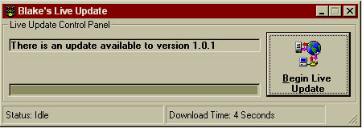



## A Live Update Program to update \.EXE's \(or other\) files off of the web\.

### Description

This code allows you to update your programs .EXE via the Internet automatically. The program checks a file on a web-server with the most recent version number in it, compares it to your version and then either downloads the new file or not depending on which one is more current. This process utilizes the INET control for the file transfers.
 
### More Info
 
Your application must make a ver.dat file in the c:\ directory that puts it's version in it. Then you must have the file with the version on the webserver (along with the most current version there). The version file simply has one line with the version number like "1.0.1" This code does work, but you will have to tailor it to work with your programs. Enjoy and vote if you like it! :)

             |
---                |---
**Submitted On**   |2000-12-07 18:31:58
**By**             |[BP](https://github.com/Planet-Source-Code/PSCIndex/blob/master/ByAuthor/bp.md)
**Level**          |Advanced
**User Rating**    |4.6 (125 globes from 27 users)
**Compatibility**  |VB 5\.0, VB 6\.0
**Category**       |[Internet/ HTML](https://github.com/Planet-Source-Code/PSCIndex/blob/master/ByCategory/internet-html__1-34.md)
**World**          |[Visual Basic](https://github.com/Planet-Source-Code/PSCIndex/blob/master/ByWorld/visual-basic.md)
**Archive File**   |[CODE\_UPLOAD124471272000\.zip](https://github.com/Planet-Source-Code/bp-a-live-update-program-to-update-exe-s-or-other-files-off-of-the-web__1-13413/archive/master.zip)

